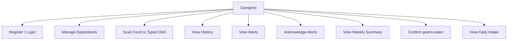
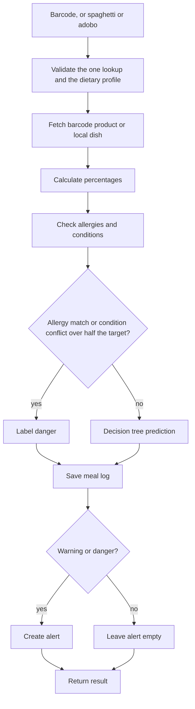
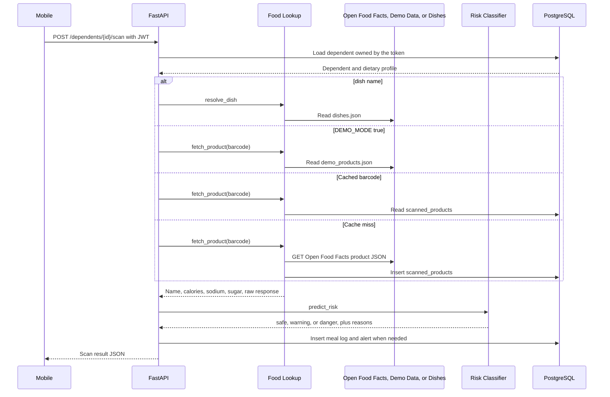
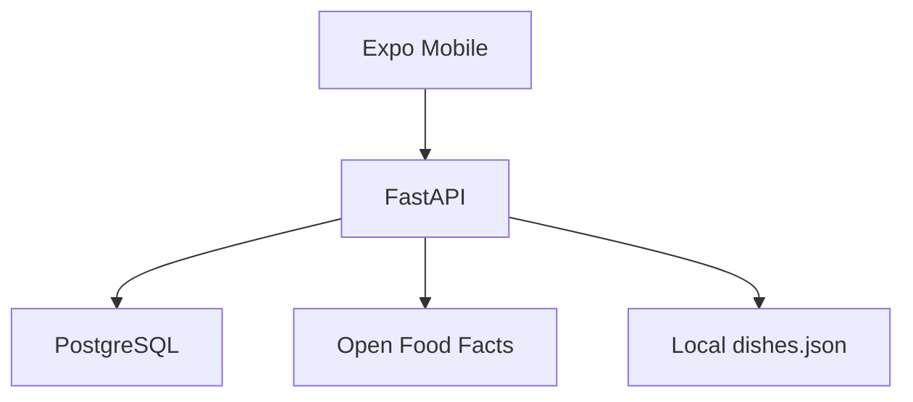
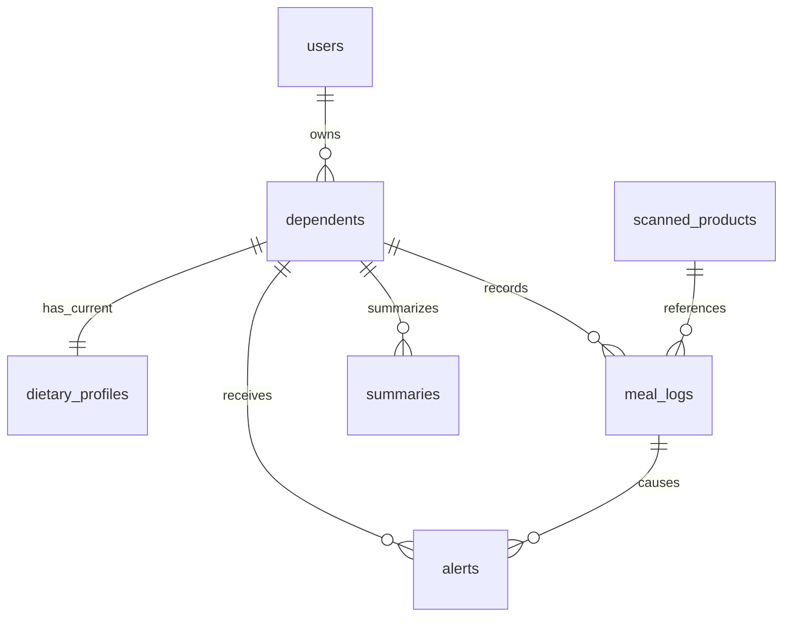

# **CCSFEN1L – INTRODUCTION TO SOFTWARE ENGINEERING** **Project Documentation**

**GROUP INFORMATION:a**  
**PROJECT TITLE:** Health Watch: A Food Consumption Health Monitoring System for Dependent Relatives 

**Group Name:** Alt Epsteins  
**Section:** COM244  
**Project Members:**

| No. | Name | Assigned Role |
| :---: | ----- | ----- |
| 1 | Santiago, Martin B.  | Project Manager / Developer / Database Designer |
| 2 | Salgado, Joseph Paolo C. | System Analyst / Developer / UI/UX Designer |
| 3 | Bacabac, Adrid T. | Developer / Documentation Specialist |
| 4 | Oredina, Reyah Shane V. | Quality Assurance Tester / Documentation Specialist |
| 5 | Villavicencio, Yvonne C. | UI/UX Designer / Documentation Specialist |

# **TABLE OF CONTENTS**

1. Project Overview   
2. Problem Statement   
3. Project Objectives   
4. Scope and Limitations   
5. Requirements   
6. System Modeling and Design   
7. System Architecture   
8. Database Design   
9. User Interface Design   
10. System Implementation   
11. Transaction Processing   
12. Software Testing   
13. Challenges and Solutions   
14. Conclusion   
15. References   
16. Appendices 

# **1\. PROJECT OVERVIEW**

Family caregivers are increasingly asked to perform tasks once handled by trained health workers, including preparing special diets for the people they care for. This pattern is well documented in the Philippine study *Ageing and Health in the Philippines*, conducted by Cruz et al. (2019). This study found that long-term care for elderly family members is handled almost entirely by family and kin rather than trained professionals, with only 5% of caregivers reporting that they had received any formal caregiving training, even though many of those they cared for had chronic conditions such as hypertension and diabetes. This shows that diet management is not a small or occasional duty for caregivers; it is a common and demanding part of everyday caregiving.

The proposed system, **Health Watch**, is a mobile application built to support this specific need. It allows a caregiver to manage the dietary needs of one or more dependents, such as elderly parents or relatives with health conditions, from a single application. The core function is simple: the caregiver scans a food item's barcode, and the system checks that food against the dependent's personal nutrition limits and medical conditions, then reports whether the food is safe, a warning, or dangerous, along with the reason.

This kind of application is supported by existing research on digital health tools. A systematic review and meta-analysis of dietary mobile applications used by adults with chronic diseases found that these applications function as effective self-monitoring tools and produce measurable improvements in nutrition-related outcomes, particularly weight loss (Fakih El Khoury et al., 2019). Similarly, an observational study on mobile health applications for chronic disease management reported that a large share of daily and weekly users experienced improvements in blood glucose levels, weight, and adherence to dietary recommendations (Spinean et al., 2025). These findings support the idea that a mobile, scan-based diet monitoring tool can produce real, practical benefits for users managing chronic conditions.

The intended users of the system are caregivers: family members or guardians responsible for the diet of a dependent relative, especially one with a condition such as diabetes or hypertension, or one who is very young or elderly. Upon completion, the system will let a caregiver register dependents, automatically calculate each dependent's personal nutrition targets, scan barcodes to check food safety in real time, and review a history of scanned meals, alerts, and weekly summaries.

# **2\. PROBLEM STATEMENT**

Managing food choices for individuals with special health needs can be challenging, especially when their nutritional requirements vary depending on their health conditions and personal needs. Caregivers who manage the diets of these dependents face the recurring challenge of determining whether a specific food is safe and appropriate for a specific person. This decision can depend on several factors, including age, weight, medical conditions, allergies, and individual daily nutrient limits. When caring for multiple dependents with different needs, caregivers may have to repeatedly remember, calculate, or compare these limits when shopping for or preparing food.

Research on caregiving confirms that this kind of task is a genuine source of strain. Interviews with family carers conducted as part of a United Kingdom medication management study found that carers experienced stress linked to gaps in information, and described burdens such as ambiguity, unfamiliarity, and being expected to cope without adequate support (Lawson et al., 2021). In the Philippine study *Ageing and Health in the Philippines*, conducted by Cruz et al. (2019), almost all family caregivers of older adults were found to have no formal training in caregiving at all, and a significant share reported leaving paid work entirely once they took on the caregiving role. Although these studies focus on caregiving broadly rather than diet specifically, they point to the same underlying issue: family caregivers are frequently left to manage complex health-related tasks with little guidance, and diet management carries a similar risk for error.

At the same time, most nutrition guidance is written for the general population rather than tailored to an individual's condition. Global health guidance sets sodium limits at less than 2,000 milligrams per day for adults (World Health Organization, 2012\) and free sugar limits at less than 10% of total daily energy intake, with additional benefit from reducing this further to below 5% (World Health Organization, 2015). These are population-wide averages; they do not account for a dependent's specific age, weight, or conditions such as diabetes or hypertension, which typically require even lower limits. A caregiver reading a nutrition label has no easy way to translate general guidance like this into a clear yes-or-no answer for a specific relative, at the moment they are deciding whether to buy or serve a food. Thus, there is currently no simple, personal tool that automatically compares a scanned food item against an individual dependent's computed daily limits, allergies, and conditions, and gives the caregiver an immediate, understandable answer.

---

The study aims to develop a food consumption health monitoring system that can help caregivers assess whether food products are appropriate for their dependent relatives based on their dietary information, allergies, and medical conditions. Specifically, it seeks to answer the following questions:

1. How may a food consumption monitoring system be designed so that a caregiver can manage a separate health profile for each dependent, including age, height, weight, sex, allergies, and medical conditions such as diabetes and hypertension?
2. How may a barcode scanning feature be developed so that a caregiver can identify a food product and retrieve its nutrition information?
3. How may the system automatically compute each dependent's daily sodium, sugar, and calorie targets from established nutrition guidance, and reduce those targets when a recorded condition requires it, instead of using one generic limit for every person?
4. How may the Open Food Facts API, a PostgreSQL database, and a locally trained Decision Tree be integrated to process food information and classify risk for a specific dependent?
5. How may the system's functionality and classification performance be evaluated in identifying whether a scanned food is safe, a warning, or a danger for that dependent?

# **3\. PROJECT OBJECTIVES**

**3.1 General Objective**  
To design and develop a mobile application that helps caregivers manage multiple dependents and determine, at the point of scanning, whether a specific food item is safe for a specific dependent, based on that dependent's personal health profile.  
**3.2 Specific Objectives**

1. To **Design** a food consumption monitoring system that allows caregivers to manage individual health profiles for each dependent, including their age, weight, height, allergies, and medical conditions, such as diabetes and hypertension.  
2. To **Develop** a barcode scanning feature that identifies food products and retrieves their nutritional information.   
3. To **Implement** a function that automatically computes each dependent's daily sodium, sugar, and calorie targets using established nutrition guidance, reducing these targets appropriately when specific conditions are present, rather than relying on a single generic limit for all users.  
4. To **Integrate** the Open Food Facts API, PostgreSQL database, and locally trained Decision Tree model to process food information and generate risk classifications.   
5. To **Evaluate** the system's functionality and classification performance in identifying whether scanned food products are **Safe, Warning, or Danger** for a dependent. 

# **4\. SCOPE AND LIMITATIONS**

**4.1 Scope**

* The system will allow a single caregiver account to register and manage multiple dependents, each with a separate profile and scan history.  
* The system will automatically calculate daily nutrition targets for sodium, sugar, and calories using standard formulas, adjusted for age band and for the presence of diabetic or hypertensive conditions, in line with World Health Organization (2012, 2015\) guidance.  
* The system will retrieve nutrition data for scanned products from the Open Food Facts database, an open and freely accessible source of food product information.  
* The system will classify each scanned product as safe, warning, or danger using a locally trained decision tree model, and will explain the classification in plain language.  
* The system will maintain a history of scanned meals, generate alerts for risky food items, and produce a weekly summary of eating patterns for each dependent.  
* The system will include an offline demo mode using a small, fixed set of sample products, to support demonstrations without depending on live internet access.
* The caregiver can type `spaghetti` or `adobo`. Those two names use a local FNRI table. They are not looked up on Open Food Facts.
* The caregiver can mark a scan as eaten and enter grams. Daily intake sums only those meals. The weekly summary still counts every scan.
* Optional conditions are Diabetic, Hypertension, High cholesterol, and Kidney disease. A dependent can be saved with none of them checked.

**4.2 Limitations**

* The decision tree still classifies from sodium, sugar, calories, an allergy flag, a condition-conflict flag, and age band. Carbohydrate, saturated fat, and protein are hard rules for the matching condition. They are not tree features, and the saved model was not retrained.
* Saturated fat is read only for high cholesterol, carbohydrate only for diabetic, and protein only for kidney disease. A missing value fails the scan only when that box is checked. Fiber is not a danger rule. The protein danger rule applies at age 12 or older and uses 1.3 g per kg of body weight per day. It does not apply to children, and there is no dialysis flag or disease stage.
* The only typed dishes are `spaghetti` and `adobo`. Any other name is not found. Adobo has no saturated-fat value, and neither dish has carbohydrate or protein, so those condition checks reject the dish instead of storing zero.
* The system does not use Optical Character Recognition or a camera model to identify a plated meal. A barcode still has to be in Open Food Facts, or in the offline demo file when demo mode is on.
* The system is a support tool, not a medical device. It does not provide medical diagnoses and is not a substitute for professional advice from a doctor or registered dietitian.
* The risk assessment is produced by a simple decision tree plus the hard rules above, not a full clinical evaluation. Reported test accuracy on the synthetic holdout is 92.90%. That figure is not clinical validation.

# 

# **5\. REQUIREMENTS**

**5.1 Target Users and Stakeholders**

The system is caregiver-facing. The dependent is a data subject, not an account holder. Other parties listed below are affected by the project or by its outputs, but they do not operate the application.

| User/Stakeholder | Type | Description |
| ----- | ----- | ----- |
| Caregiver | Primary user | Family member or guardian who registers, logs in, and uses the application. The caregiver adds and edits dependents, scans barcodes or types an allowed dish name, confirms grams eaten, and reviews history, alerts, daily intake, and weekly summaries. Authorization is based on the caregiver's JWT, not on an identifier sent by the client. |
| Dependent | Indirect user / data subject | Relative whose age, height, weight, sex, allergies, and conditions are stored so that daily targets and scan results can be computed. The dependent does not register, log in, or receive a separate account. |
| Family household | Stakeholder | Other relatives who may rely on the caregiver's food decisions. They do not have in-app roles. The application stores only the caregiver account and the dependents that caregiver registers. |
| Course instructor and evaluators | Stakeholder | Academic audience for the one-week software engineering project. They require a working demo (including offline `DEMO_MODE`), documented design, and test evidence. They do not use the product as caregivers. |
| Development team | Stakeholder | The student group that designed, implemented, tested, and documented Health Watch. They maintain the Expo client, FastAPI service, PostgreSQL schema, and the committed decision-tree artifacts. |
| Health professionals (doctors, dietitians) | Indirect stakeholder | The intended clinical audience for genuine medical advice. The application is a support tool, not a medical device, and does not replace professional judgment. |

**5.2 Functional Requirements**  
*List the major functions of the system.*

|  | Description |
| :---: | ----- |
| FR-01 | The system shall allow a caregiver to register and log in with an email and a password. The implemented account does not have a separate username. |
| FR-02 | The system shall allow a caregiver to add, edit, and manage multiple dependents, each with their own profile (age, height, weight, sex, allergies, and conditions).  |
| FR-03 | The system shall automatically compute a dependent's daily sodium, sugar, and calorie targets whenever their profile is created or updated.  |
| FR-04 | The system shall allow a caregiver to scan a food product's barcode and retrieve its nutrition information.  |
| FR-05 | The system shall compare a scanned food's nutrition data against a dependent's targets, allergies, and conditions, and classify it as safe, warning, or danger.  |
| FR-06 | The system shall save every scan as a meal log entry linked to the correct dependent.  |
| FR-07 | The system shall generate an alert whenever a scanned food is classified as warning or danger.  |
| FR-08 | The system shall let a caregiver view a dependent's meal history and alerts.  |
| FR-09 | The system shall generate a weekly summary of a dependent's eating pattern based on their scan history.  |
| FR-10 | The system shall accept the dish names spaghetti and adobo and run the same classification, meal-log, and alert steps used for a barcode. |
| FR-11 | The system shall let the caregiver record grams eaten, and shall report daily intake from those meals only. |

**5.3 Non-Functional Requirements**

| Quality | Requirement |
| ----- | ----- |
| Performance | The course target is a food-safety result within 3 seconds after a barcode is scanned, under normal network conditions. The implemented Open Food Facts client uses a 10-second timeout. That 3-second line has not been measured for live lookups. |
| Security | The system shall only allow a caregiver to view or edit the profiles and data of their own registered dependents. |
| Usability | The system shall display safe, warning, and danger as readable text. History rows use a distinct fill for each label. |
| Reliability | The system shall continue to function in offline demo mode using saved sample products, and the two typed dishes, if there is no internet connection. |

**5.4 Business Rules**  
*List the rules that govern how the system operates.*

1. A caregiver can only view and manage dependents that they personally registered.  
2. Every dependent's daily nutrition targets must be calculated by the system; caregivers cannot enter these values manually.  
3. A food item is automatically marked as "danger" if it contains an ingredient matching one of the dependent's listed allergies, regardless of other nutrition values.  
4. Every scan result, whether safe, warning, or danger, must be saved to the dependent's meal history for record-keeping.
5. A new scan is not eaten until the caregiver confirms a gram amount. Daily intake uses those confirmed meals. The weekly summary still counts every scan.

**5.5 Requirements Gathering**  
Indicate the method/s used to gather requirements.  
☐ Interview  
☐ Observation  
☐ Questionnaire  
☑ Document Analysis  
☐ Other: ___________

**Method justification.** Document analysis was selected as the primary requirements-gathering method. The project is a one-week course system with a written specification, published nutrition guidance, and a public food API. Interview, observation, and questionnaire methods were not used: the team did not have access to a recruited caregiver sample, and medical claims were not to be invented from informal conversation. Analysis therefore meant reading existing documents, extracting operational rules, input and output schemas, performance expectations, and constraints, and recording only those items that the later implementation could satisfy.

**Primary objective.** Identify who uses the system, what a scan must do, which data may be stored or rejected, and which rules a caregiver must not be allowed to override, without live participant sessions.

**Key artifacts analyzed.**

| Artifact | What was extracted |
| ----- | ----- |
| Course project specification | Caregiver as the only actor; JWT ownership; PostgreSQL through SQLAlchemy; local Decision Tree; standard error JSON; scan steps (validate, fetch, percentages, allergy, conditions, predict, meal log, alert); demo mode; computed daily targets that the client cannot post |
| Academic and guideline literature already cited in Sections 1–2 | Caregiving context (Cruz et al., 2019; Lawson et al., 2021); dietary mHealth support (Fakih El Khoury et al., 2019; Spinean et al., 2025); WHO sodium and free-sugar baselines (World Health Organization, 2012, 2015) |
| Named nutrition references required by the specification | Mifflin-St Jeor calorie equation and sedentary multiplier 1.2; hypertension sodium reduction of 30%; diabetic sugar reduction of 50%; WHO saturated-fat share (10% of energy / 9); AMDR carbohydrate upper share (65% of energy / 4); KDIGO 2024 protein ceiling of 1.3 g per kg per day for adults, with no protein restriction rule for children |
| Open Food Facts API documentation | Barcode product URL, per-100 g nutriments, structured allergen tags; missing values must not be stored as zero |
| FNRI food composition library (two committed rows only) | `spaghetti` and `adobo` per 100 g; adobo saturated fat is missing |
| Running codebase, API contract, and technical logs | Implemented routes, schemas, demo barcodes, training dataset and evaluation report, defect log |

**How the analysis was applied.** Functional requirements FR-01 to FR-11 were taken from the specification and confirmed against the running routes (register and login, dependents, scan, meals, alerts, weekly summary, eaten grams, daily intake). Non-functional requirements were taken from the same documents: ownership and hashed passwords for security; `DEMO_MODE` and local dishes for reliability; readable risk labels for usability; a course timing expectation of three seconds, recorded honestly as unmeasured for live Open Food Facts calls because the implemented client timeout is ten seconds. Business rules follow directly from those documents: targets are server-computed, allergy match forces danger, every scan is logged, and daily intake counts only confirmed grams.

**Outcome.** The analysis produced the stakeholder table in Section 5.1, the functional and non-functional tables in Sections 5.2–5.3, and the business rules in Section 5.4. It also fixed structural constraints used in implementation: nutrition is per 100 g; required nutrients that are missing fail the scan; carbohydrate, saturated fat, and protein are read only when the matching condition is checked; the Decision Tree is not retrained when those hard rules are added; typed names other than `spaghetti` and `adobo` return not found. The method did not produce interview-based personas or observed shopping workflows, and those were not claimed.

# **6\. SYSTEM MODELING AND DESIGN**

*Include the appropriate UML diagrams required for the project.*

The diagrams below match the running routes. The maintained copies, including the class, state, and component diagrams, are in [diagrams.md](diagrams.md).

**6.1 Use Case Diagram**

The caregiver is the only actor. Register and login are public. Later cases use the JWT.

**6.2 Activity Diagram**

An allergy match, or a condition conflict above half the matching target, is danger before the tree. Warning and danger create an alert. The meal starts uneaten.

**6.3 Class Diagram**

The class diagram is in [diagrams.md](diagrams.md). It shows `User`, `Dependent`, `DietaryProfile`, `ScannedProduct`, `MealLog`, `Alert`, and `Summary` from `backend/app/models.py`. Request bodies stay in `backend/app/schemas.py`.

**6.4 Sequence Diagram**

# **7\. SYSTEM ARCHITECTURE**

*Present the overall architecture of the system.*

The phone is Expo and React Native. FastAPI loads the decision tree in process and talks to PostgreSQL 16. Open Food Facts is used only for a live barcode lookup. Typed dishes and demo mode stay on local files. Detail is in [ARCHITECTURE.md](ARCHITECTURE.md).

# **8\. DATABASE DESIGN**

**8.1 Entity Relationship Diagram**

Caregiver accounts own dependents. Each dependent has one dietary profile. Meal logs point at a cached product. Alerts point at a meal log. Summaries are one row per dependent and week start. `meal_logs.eaten` and `meal_logs.grams_eaten` record a confirmed amount. The full diagram is in [database.md](database.md).

**8.2 Database Tables**

| Table | Purpose |
| ----- | ----- |
| users | Caregiver name, unique email, and password hash |
| dependents | Owned person: age, height, weight, and sex |
| dietary_profiles | Allergies, conditions, and computed calorie, sodium, and sugar targets |
| scanned_products | Cached barcode or dish nutrition, including the raw JSON |
| meal_logs | One scan: risk label, reasons, eaten flag, and grams eaten |
| alerts | Warning or danger message, active or acknowledged |
| summaries | Templated weekly sentence for one dependent and week start |

# **9\. USER INTERFACE DESIGN**

*Include screenshots or prototypes of the major system interfaces.*  
**9.1 Login Page**  
\[Insert screenshot\]

**9.2 Dashboard**  
\[Insert screenshot\]

**9.3 Transaction Page**  
\[Insert screenshot\]

**9.4 Other Major Interfaces**  
\[Insert screenshots\]

# **10\. SYSTEM IMPLEMENTATION**

The system was built as two coordinated parts: an Expo React Native client in TypeScript and a Python FastAPI backend with PostgreSQL. Work followed the required scan transaction instead of a single handler. Route functions in the API orchestrate validation, food lookup, percentage calculation, allergy matching, condition checks, local decision-tree prediction, meal-log creation, and alert creation. The phone application never invents a risk label; it displays the JSON returned by the backend.

Development proceeded in layers. First, Docker Compose started PostgreSQL 16, and SQLAlchemy models created the tables for users, dependents, dietary profiles, scanned products, meal logs, alerts, and summaries. Authentication was added next: registration stores a PBKDF2-SHA256 password hash, and login issues a JWT whose `sub` claim is the caregiver id. Dependent create and update hooks call `compute_daily_targets` so sodium, sugar, and calorie limits are stored with the profile and cannot be posted by the client.

Food lookup was implemented as a cache-first barcode path. When `DEMO_MODE` is false, a miss calls Open Food Facts and stores the product; when `DEMO_MODE` is true, lookups read `backend/demo_products.json` and stay offline. Typed names resolve only `spaghetti` and `adobo` from `backend/dishes.json`. The committed scikit-learn Decision Tree (`max_depth=5`, `random_state=42`) is loaded with joblib at API startup. Hard safety rules still run first: an allergy match, or a condition nutrient above half of its daily target, is labeled danger before the tree is consulted.

The mobile client was organized under `mobile/src/` with separate API types, screens, and navigation. After login, the caregiver selects a dependent and uses tabs for Scan, History, Alerts, Summary, and Intake. The scanner requests camera permission, applies a cooldown against duplicate rapid scans, and also accepts a typed barcode or dish name. Loading, empty, and error states use a shared status component with retry. Backend behavior is covered by pytest against PostgreSQL; the mobile project is checked with `npx tsc --noEmit`.

**10.1 Development Tools and Technologies**

| Tool/Technology | Purpose |
| ----- | ----- |
| Python, FastAPI, SQLAlchemy, Pydantic | API, validation, and database access |
| PostgreSQL 16 | Application database, through Docker |
| scikit-learn Decision Tree, joblib | Local risk classifier |
| Expo, React Native, TypeScript | Caregiver phone app |
| pytest | Backend tests |
| Open Food Facts API | Live barcode nutrition and allergen tags |
| Docker Compose | Local PostgreSQL 16 for application and tests |

**10.2 Major System Features**

1. Register, login, and JWT ownership of dependents.
2. Computed calorie, sodium, and sugar targets, plus condition checks for hypertension, diabetic, high cholesterol, and kidney disease.
3. Barcode scan through Open Food Facts or offline demo products, and typed lookup for spaghetti and adobo.
4. Meal history, alerts, weekly summary, eaten grams, and daily intake. 

# **11\. TRANSACTION PROCESSING**

*Describe the major transactions of the system.*

Each major transaction should generally demonstrate:  
**Input → Validation → Processing → Database Update → Confirmation/Output**

**Transaction 1: Food scan**

**Input:**  
A barcode of 8–14 digits, or the dish name spaghetti or adobo, for one owned dependent.

**Validation:**  
The JWT caregiver must own the dependent. The body must contain exactly one lookup. A dietary profile must exist. Required nutrition must be present. A condition nutrient is required only when that condition is checked.

**Processing:**  
Percentages, allergy match, condition conflicts, then the local decision tree when no hard rule forces danger.

**Database Update:**  
One transaction stores or reuses the product, inserts a meal log with eaten false, and inserts an alert when the label is warning or danger.

**Confirmation/Output:**  
The phone shows safe, warning, or danger, the reasons, and calories, sodium, and sugar. Saturated fat, carbohydrate, or protein appears only when that value was checked and is above half its target.

**Screenshot:**  
Not inserted in this file.

**Transaction 2: Confirm eaten amount**

**Input:**  
Meal log id and grams greater than zero.

**Validation:**  
The meal must belong to a dependent owned by the JWT caregiver.

**Processing:**  
The grams are stored and the meal is marked eaten.

**Database Update:**  
`meal_logs.eaten` becomes true and `grams_eaten` is set. Daily intake on the next read includes that meal. The weekly summary already counted the scan.

**Confirmation/Output:**  
The meal response returns the id, eaten true, grams, and risk label.

# **12\. SOFTWARE TESTING**

**12.1 Test Plan**

Backend business logic is tested with pytest against PostgreSQL. The mobile project is typechecked with `npx tsc --noEmit`. The offline demo is the barcode script in [DEMO_SCRIPT.md](DEMO_SCRIPT.md).

**12.2 Test Cases and Results**

| Test Case ID | Feature/Transaction | Expected Result | Actual Result | Status |
| ----- | ----- | ----- | ----- | ----- |
| TC-01 | Demo barcodes on Demo Hypertension | `2000000000015` safe, `2000000000022` warning, `2000000000039` danger | Covered by the scan tests and the demo script | Pass in the scan suite |
| TC-02 | Typed dishes | spaghetti and adobo classify; any other name is not found; adobo with high cholesterol is invalid | Covered by the dish scan tests | Pass when those tests were run |
| TC-03 | Decision tree holdout | Test accuracy at least 90% | 92.90% in [MODEL_EVALUATION.md](MODEL_EVALUATION.md) | Pass |
| TC-04 | Daily intake carbohydrate limit | API limit matches the unrounded formula inside the default approx tolerance | The API returns 305.66 and the formula is 305.6625 | Fail, see D6 |

**12.3 s and CorreDefectctive Actions**

| Defect | Corrective Action | Status |
| ----- | ----- | ----- |
| Evaluation file recorded Python 3.14.7 while this machine uses 3.11 | Metrics are compared without treating the Python version string as part of the match | Resolved |
| Daily intake limit is rounded to two decimal places and one intake test uses a tighter comparison | Not changed yet | Pending |

**12.4 User Acceptance Testing (UAT)**  
***When applicable, include the UAT results.***  
\[Insert UAT evidence/results.\]

# **13\. CHALLENGES AND SOLUTIONS**

Development took place under a one-week deadline, a fixed technology list, and incomplete external food data. The table records problems that actually appeared during implementation and testing, and the solutions that were applied.

| Challenge | Solution |
| ----- | ----- |
| Windows PostgreSQL 18 was already bound to port 5432, so Docker Postgres rejected the expected password and the API could not start (defect D1). | The local PostgreSQL 18 service was stopped. Docker Compose PostgreSQL 16 was left on 5432 for both the application database and the test database. |
| A physical phone could not reach FastAPI when `EXPO_PUBLIC_API_URL` still pointed at an old address, or when Windows Firewall did not allow port 8000 on the current Wi-Fi profile (defect D2). | The mobile environment must use this computer’s current LAN IPv4 address. Expo is restarted with cache cleared. Port 8000 is allowed on the private network. This remains an environment setup step, not a code defect that is fully closed. |
| `DEMO_MODE=true` correctly blocks live Open Food Facts, so barcodes that exist online but are absent from `demo_products.json` return product not found (defect D3). Testers initially treated that as a lookup bug. | Demo mode is documented as an offline course path. Local `.env` is set to `DEMO_MODE=false` for live lookup. The three demo hypertension barcodes stay in the demo file so the scripted demo still runs without the internet. |
| Incomplete Open Food Facts records. Many products omit calories, sodium, sugar, or a condition-specific nutrient. Treating a blank as zero would understate risk. | Required per-100 g values that are missing, non-numeric, or negative return `PRODUCT_DATA_INVALID`. Saturated fat, carbohydrate, and protein are requested only when the matching condition is checked. Fiber is never used as a danger rule. |
| Weekly summary SQL counted alert reasons with a cartesian product and the endpoint returned 503 (defect D4). | Reasons are counted with a single `jsonb_array_elements_text` statement. The weekly text is a template from stored meal statistics, not a language model. |
| Later requirements added high cholesterol, diabetic carbohydrate, and kidney-disease protein, but the committed Decision Tree must not be replaced or retrained. | Those nutrients are hard rules before the tree (danger above half of the matching daily target). Allergy match still wins. The pickle, feature order, and training scripts stay as originally committed. |
| Synthetic training evaluation files recorded Python 3.14.7 while the development environment uses 3.11, which broke a strict file comparison (defect D5). | Reproducibility still requires matching accuracy, confusion matrix, library versions, and tree artifacts. The interpreter version string is no longer treated as part of that match. |
| Duplicate camera scans and missing camera permission would produce repeated meal logs or a blank scanner. | The scanner requests permission, applies a cooldown, shows loading, and offers manual barcode entry plus the two typed dish names. Results come only from the backend. |
| Daily intake carbohydrate limit is rounded half-up to two decimal places (305.66) while one test compared the unrounded formula (305.6625) (defect D6). | The displayed/API rounding was left in place. The test assertion still needs a wider tolerance or a comparison against the already rounded value. |

# **14\. CONCLUSION**

**14.1 Summary of the completed project**

Health Watch is a caregiver-facing mobile application, backed by FastAPI and PostgreSQL, for monitoring food consumption of dependent relatives. A caregiver registers with an email and hashed password, logs in to receive a JWT, and manages one or more dependents. Each dependent has a dietary profile whose daily calorie, sodium, and sugar targets are computed from age, height, weight, sex, and recorded conditions. The caregiver then scans an 8–14 digit barcode, or types `spaghetti` or `adobo`, for that dependent. The backend looks up per-100 g nutrition, computes percentages of the stored targets, checks allergies and condition conflicts, applies a locally loaded Decision Tree when no hard rule forces danger, writes a meal log, and creates an alert when the label is warning or danger. The phone shows the returned label, reasons, and product values. The caregiver can later confirm grams eaten; daily intake sums only those meals, while the weekly summary still counts every scan. Offline course demonstration uses `DEMO_MODE` and three fixed barcodes. The system is a support tool, not a medical device.

**14.2 Whether the objectives were achieved**

The general objective in Section 3.1 was achieved within the stated scope: a caregiver can manage multiple dependents and obtain a per-person `safe`, `warning`, or `danger` result at scan time from that dependent’s profile.

| Specific objective | Result |
| ----- | ----- |
| SO-1. Design individual dependent profiles (age, weight, height, allergies, conditions including diabetes and hypertension) | Achieved. Create and edit forms store those fields. Optional checkboxes also cover high cholesterol and kidney disease. A dependent may be saved with no condition checked. Targets are never entered by the caregiver. |
| SO-2. Develop barcode scanning that identifies a product and retrieves nutrition | Achieved. Camera scan with permission and cooldown, plus manual barcode entry, call `POST /dependents/{id}/scan`. Live lookup uses Open Food Facts; demo mode uses `demo_products.json`. Typed dishes are a separate local table, not a substitute for scanning. |
| SO-3. Automatically compute daily sodium, sugar, and calorie targets from established guidance, reduced when conditions require it | Achieved. Mifflin-St Jeor plus a named activity multiplier, child and elderly factors, 2000 mg sodium baseline with a 30% hypertension reduction, and free sugar as 10% of calories / 4 with a 50% diabetic reduction. Additional hard limits for carbohydrate, saturated fat, and protein apply only when those conditions are recorded. |
| SO-4. Integrate Open Food Facts, PostgreSQL, and a locally trained Decision Tree | Achieved. Successful live barcodes are cached in `scanned_products`. The tree is a committed `DecisionTreeClassifier` loaded with joblib inside FastAPI. Allergy match and condition conflict above half of the matching target force danger before the tree. |
| SO-5. Evaluate functionality and classification performance for safe, warning, and danger | Achieved as a course evaluation, not as clinical validation. Backend business logic is covered by pytest against PostgreSQL. The mobile project is typechecked with `npx tsc --noEmit`. Holdout accuracy on 1000 synthetic test rows is 92.90% (precision/recall: safe 0.94/0.98, warning 0.88/0.78, danger 0.93/0.90). Demo barcodes on Demo Hypertension produce the required safe, warning, and danger path. |

Objectives that were never in Section 3 were not treated as incomplete work: there is no chatbot, OCR of plated meals, payment, or remote language-model inference.

**14.3 Major accomplishments**

1. An end-to-end caregiver flow that matches the required demonstration: register or login, select a dependent, scan a safe item, a warning item, and a danger item, then open alerts, history, and the weekly summary, including the offline demo barcodes `2000000000015`, `2000000000022`, and `2000000000039`.
2. A visible scan transaction with separate functions rather than one undifferentiated route handler, and one database transaction for product reference, meal log (`eaten` false), and optional alert, with rollback on failure.
3. Authorization from the JWT caregiver id only, so one account cannot read or change another caregiver’s dependents, meals, or alerts. Passwords are stored as PBKDF2-SHA256 hashes.
4. Deterministic, human-readable reasons (for example allergy match, sodium or sugar high or exceeding the daily target, and condition-specific conflict sentences) instead of inspecting the tree at request time.
5. Condition-specific nutrients handled without retraining the model: saturated fat for high cholesterol, carbohydrate for diabetic (in addition to sugar), protein for kidney disease at age 12 or older, with missing values rejected rather than stored as zero.
6. Committed machine-learning artifacts (generator, 5000-row dataset, trainer, pickle, feature order, readable tree, evaluator) with test accuracy above the 90% course floor.
7. Caregiver tools beyond the scan itself: meal history, alert acknowledgement, templated weekly summary from real counts, confirm-grams, and daily intake scaled from per-100 g values.

**14.4 Overall system performance**

Functional performance is sufficient for the course demonstration. `/health` confirms PostgreSQL connectivity. Scan, meal, alert, summary, and intake routes operate against the owned dependent. Demo mode and the two FNRI dishes work without Open Food Facts. Successful live products are reused from `scanned_products` so the same barcode is not fetched repeatedly.

Classification performance on the synthetic holdout meets the numeric target: 92.90% accuracy. Warning recall (0.78) is the weakest class, which is expected from class counts (warning is the smallest label). That figure is not a clinical trial and must not be presented as medical accuracy.

Reliability still depends on external data quality and local setup. Live barcode success requires Open Food Facts to return finite per-100 g calories, sodium, and sugar. Condition checkboxes add further required fields. The implemented HTTP timeout for Open Food Facts is ten seconds; the three-second course timing statement in Section 5.3 was not measured on live lookups. A phone on another network still needs a correct `EXPO_PUBLIC_API_URL` and firewall rule (defect D2). Defect D6 remains open: the daily-intake carbohydrate limit is rounded to 305.66 while an unrounded comparison expects 305.6625.

**14.5 Possible improvements**

If work continued after the one-week limit, the next engineering steps would be: measure live scan latency against the three-second target; close D6 by aligning the intake test with rounded API limits; close or document D2 as a deployment checklist for Expo on a physical device; expand the local dish table beyond two FNRI rows so typed names are less brittle; and add more complete demo products for high cholesterol and kidney disease without changing the hypertension demo barcodes.

Product limitations that should stay explicit in any future version: barcodes missing nutrition will still fail rather than guess; adobo will still be invalid for a high-cholesterol dependent because saturated fat is missing; the tree should remain a classroom classifier unless it is retrained and re-evaluated with an approved feature set; the application should not be described as a diagnostic or dietitian substitute. Optical character recognition, wearable tracking, and remote AI APIs were excluded by the project rules and are not listed as unfinished requirements. 

# **15\. REFERENCES**

Cruz, G. T., Natividad, J. N., & Saito, Y. (2019). Discussion, conclusions, and recommendations. In G. T. Cruz, C. J. P. Cruz, & Y. Saito (Eds.), *Ageing and health in the Philippines* (pp. 215–226). Economic Research Institute for ASEAN and East Asia. [https://www.eria.org/uploads/media/Books/2019-Dec-Ageing-and-Health-Philippines/20-Ageing-and-Health-Philippines-Chapter-14-new.pdf](https://www.eria.org/uploads/media/Books/2019-Dec-Ageing-and-Health-Philippines/20-Ageing-and-Health-Philippines-Chapter-14-new.pdf)

Fakih El Khoury, C., Karavetian, M., Halfens, R. J. G., Crutzen, R., Khoja, L., & Schols, J. M. G. A. (2019). The effects of dietary mobile apps on nutritional outcomes in adults with chronic diseases: A systematic review and meta-analysis. *Journal of the Academy of Nutrition and Dietetics, 119*(4), 626–651. [https://doi.org/10.1016/j.jand.2018.11.010](https://doi.org/10.1016/j.jand.2018.11.010)

Lawson, S., Mullan, J., Wong, G., Zaman, H., Booth, A., Watson, A., & Maidment, I. (2021). Family carers' experiences of managing older relative's medications: Insights from the MEMORABLE study. *Patient Education and Counseling.* Advance online publication. [https://doi.org/10.1016/j.pec.2021.12.017](https://doi.org/10.1016/j.pec.2021.12.017)

Spinean, A., Mladin, A., Carniciu, S., Stănescu, A. M. A., & Serafinceanu, C. (2025). Emerging methods for integrative management of chronic diseases: Utilizing mHealth apps for lifestyle interventions. *Nutrients, 17*(9), Article 1506\. [https://doi.org/10.3390/nu17091506](https://doi.org/10.3390/nu17091506)

World Health Organization. (2012). *Guideline: Sodium intake for adults and children.* World Health Organization. [https://www.ncbi.nlm.nih.gov/books/NBK133309/](https://www.ncbi.nlm.nih.gov/books/NBK133309/)

World Health Organization. (2015, March 4). *WHO calls on countries to reduce sugars intake among adults and children* \[Press release\]. [https://www.who.int/news/item/04-03-2015-who-calls-on-countries-to-reduce-sugars-intake-among-adults-and-children](https://www.who.int/news/item/04-03-2015-who-calls-on-countries-to-reduce-sugars-intake-among-adults-and-children)

# **16\. APPENDICES**

*Include supporting documents and evidence.*  
Possible contents:

* **Appendix A – Requirements Gathering Evidence**   
* **Appendix B – Additional UML Diagrams**   
* **Appendix C – Additional Screenshots**   
* **Appendix D – Testing Evidence**   
* **Appendix E – UAT Results**   
* **Appendix F – Source Code / Repository Information**   
* **Appendix G – Individual Contributions** 

**INDIVIDUAL CONTRIBUTION**

| Member | Assigned Responsibilities | Actual Contribution |
| ----- | ----- | ----- |
| Bacabac, Adrid T. | Developer / Documentation Specialist | \[Contribution\] |
| Oredina, Reyah Shane V. | Quality Assurance Tester / Documentation Specialist | \[Contribution\] |
| Salgado, Joseph Paolo C. | System Analyst / Developer / UI/UI Designer | \[Contribution\] |
| Santiago, Martin B.  | Project Manager / Developer / Database Designer | \[Contribution\] |
| Villavicencio, Yvonne C. | UI/UX Designer / Documentation Specialist | \[Contribution\] |

