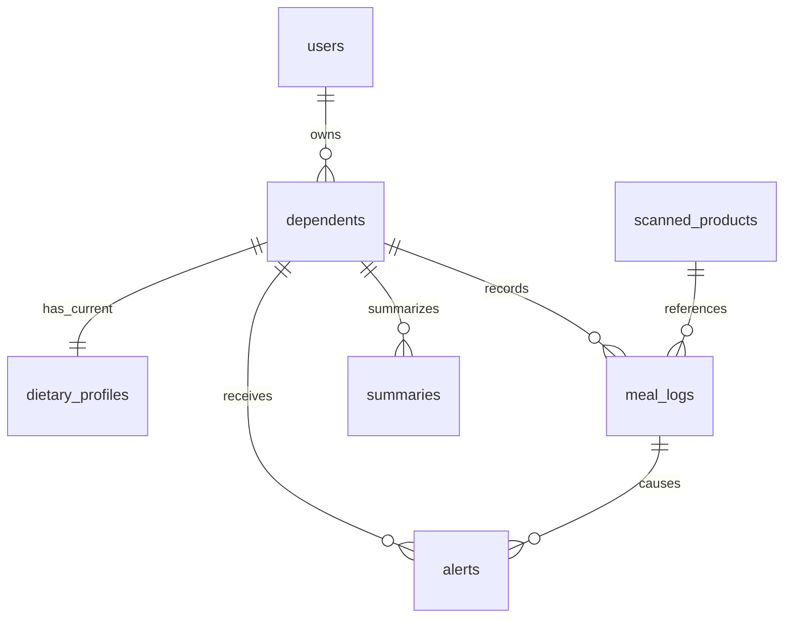

# Database implementation

## Create tables and demo data

From `backend`, with the virtual environment active and Docker PostgreSQL running:

```powershell
python init_db.py
python seed.py
python seed.py
pytest
```

`init_db.py` uses SQLAlchemy `Base.metadata.create_all`: it creates missing tables
without deleting records, and can be repeated. It does **not** alter existing
columns or constraints; future schema changes need explicit SQL changes or a
migration plan. No Alembic is needed for this initial schema.

The seed creates `demo@foodmonitor.local` with development password
`DemoCaregiver123!`. Only a randomly salted PBKDF2-SHA256 hash is stored, using
600,000 iterations. Running the seed again preserves the password and existing
demo records. Demo dependents are located by caregiver and their stable demo
names; renaming a demo dependent means a subsequent seed will restore a new
record with the original demo name. The seed is intended for sequential local
runs, not concurrent provisioning.

| Demo dependent | Condition | Calories/day | Sodium mg/day | Sugar g/day |
| --- | --- | ---: | ---: | ---: |
| Demo Hypertension (male, 60, 170 cm, 75 kg) | hypertension | 1821.00 | 1400.00 | 45.53 |
| Demo Diabetes (female, 55, 160 cm, 65 kg) | diabetic | 1456.80 | 2000.00 | 18.21 |

These displayed values are results of `compute_daily_targets`, not seed inputs.

## Write contract and constraints

- Use `SessionLocal` and normal ORM `Session.add`/`commit` operations for dependent
  and profile writes. A `before_flush` hook creates a profile with empty allergy
  and condition arrays when needed, normalizes arrays, and recomputes targets.
- Edit the existing `dependent.dietary_profile`; do not replace it. Physical or
  condition changes update that row and retain its ID. Manually supplied target
  values are overwritten by the calculation. In-place array edits are tracked.
- PostgreSQL enforces **at most one** profile with a unique `dependent_id`.
  The ORM supplies the **at least one** part of the invariant. Direct SQL/bulk
  writes bypass this lifecycle hook, so they must not be used by future caregiver
  endpoints. Deleting a profile alone through the ORM is rejected.
- The project accepts integer ages 0–120, positive height/weight and targets,
  and `male`/`female` as the inputs supported by the specified equation.
- All timestamps use `timestamptz`; numeric quantities use fixed-scale `numeric`.
  `updated_at` changes on SQLAlchemy updates (there is no raw-SQL timestamp trigger).
- Allergies and conditions use PostgreSQL `text[]`; raw food responses and risk
  reasons use `jsonb`. Product quantities are per 100g and cannot be negative.
- Email, cached barcode, dependent profile, and dependent/week summary keys are
  unique. Foreign-key lookup columns are indexed. Risk labels and alert statuses
  are constrained to the specified values.
- An alert has a composite foreign key to its meal log and dependent: a valid
  meal-log ID cannot be attached to the wrong dependent.
- Deleting a caregiver/dependent cascades to its owned records. Cached products
  remain; deleting a product referenced by a meal log is restricted.

## Target calculation assumptions

`app/targets.py` is the one shared calculation. It applies the required
Mifflin-St Jeor equation and a named 1.2 sedentary activity multiplier (project
baseline assumption). It then applies age-band factors, hypertension's required
30% sodium reduction, and diabetes's required 50% sugar reduction. Free sugar
starts at 10% of calories divided by 4. Results use Decimal arithmetic and round
half up to two decimal places; non-positive results are rejected.

The age factors are **documented course approximations**, not published clinical
multipliers for Mifflin-St Jeor. That adult equation is not validated here for
children, especially infants; the age 0–120 storage range does not validate
clinical suitability. The course's age bands also differ from source age bands.

- Child calories: factor 0.8, derived from representative sedentary reference
  values 1600 / 2000 in [NHLBI Table 5-1](https://www.nhlbi.nih.gov/sites/default/files/publications/12-7486.pdf)
  (girls 9–13 and women 19–30 upper values). This single representative ratio is
  applied to the required under-12 course band.
- Child sodium: factor 0.8 uses that energy ratio, following the principle of
  downward energy-based scaling in [WHO sodium guidance](https://www.who.int/news-room/fact-sheets/detail/sodium-reduction).
- Elderly calories: female factor 1600 / 2000 and male factor 2200 / 2600, comparing
  [NIA inactive older-adult reference values](https://order.nia.nih.gov/sites/default/files/2019-10/Healthy-Eating-2019-update-508.pdf)
  with NHLBI young-adult upper reference values. Applying these ratios in addition
  to the equation's age term is a project simplification, not a validated model.
- Elderly sodium: factor 0.75 gives 1500 mg from the required 2000 mg baseline.
  The project adopts the [AHA optimal goal for most adults](https://www.heart.org/en/healthy-living/healthy-eating/eat-smart/sodium/how-much-sodium-should-i-eat-per-day)
  for its over-65 band. AHA does not specify this particular age cutoff or factor.

## File mapping

| File | Responsibility |
| --- | --- |
| `backend/app/database.py` | Declarative base, engine, session factory, table creation |
| `backend/app/models.py` | Seven tables, relationships, constraints, profile maintenance |
| `backend/app/targets.py` | Shared deterministic target calculation |
| `backend/app/passwords.py` | Standard-library password hashing |
| `backend/init_db.py` | Development table-creation command |
| `backend/seed.py` | Idempotent demo records |
| `backend/tests/test_models.py` | Real PostgreSQL relationships, constraints and seed tests |
| `backend/tests/test_targets.py` | Formula, age boundaries and invalid-input tests |

Tests use the dedicated `TEST_DATABASE_URL` and rollback test records. No SQLite
substitute is used. Existing health-endpoint tests remain part of the suite.


