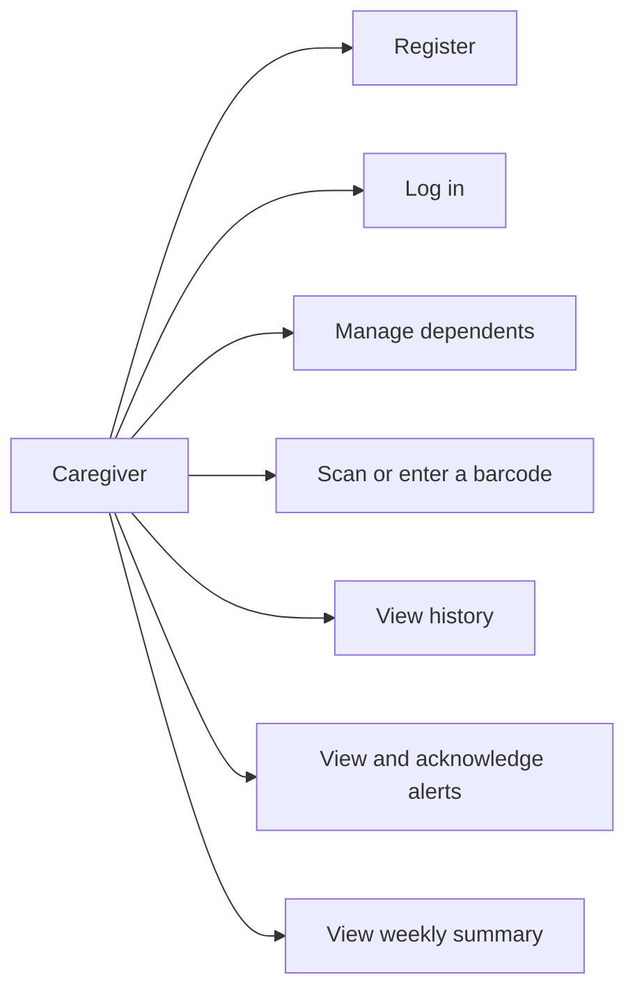
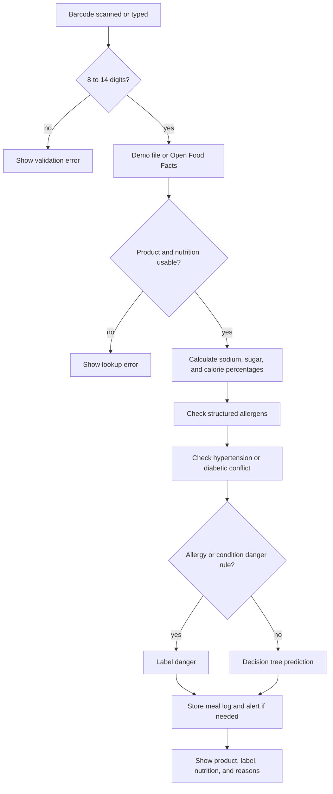
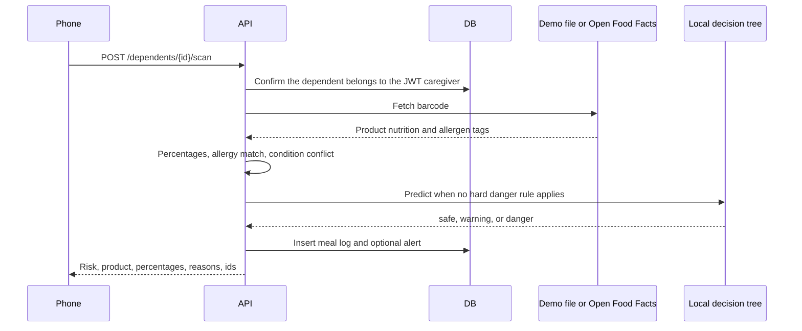
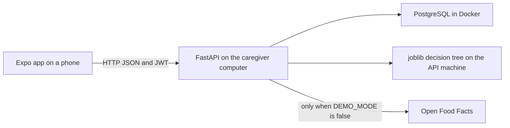

# Diagrams

The entity-relationship diagram is in [database.md](database.md).

## Use case

```mermaid
flowchart LR
  caregiver[Caregiver]
  caregiver --> register[Register]
  caregiver --> login[Log in]
  caregiver --> dependents[Manage dependents]
  caregiver --> scan[Scan or enter a barcode]
  caregiver --> history[View history]
  caregiver --> alerts[View and acknowledge alerts]
  caregiver --> summary[View weekly summary]
```

## Scan activity

```mermaid
flowchart TD
  startNode[Barcode scanned or typed] --> valid{8 to 14 digits?}
  valid -->|no| invalid[Show validation error]
  valid -->|yes| lookup[Demo file or Open Food Facts]
  lookup --> found{Product and nutrition usable?}
  found -->|no| notFound[Show lookup error]
  found -->|yes| percent[Calculate sodium, sugar, and calorie percentages]
  percent --> allergy[Check structured allergens]
  allergy --> condition[Check hypertension or diabetic conflict]
  condition --> rules{Allergy or condition danger rule?}
  rules -->|yes| danger[Label danger]
  rules -->|no| tree[Decision tree prediction]
  danger --> save[Store meal log and alert if needed]
  tree --> save
  save --> result[Show product, label, nutrition, and reasons]
```

## Scan sequence

```mermaid
sequenceDiagram
  participant Phone
  participant API
  participant DB
  participant Food as Demo file or Open Food Facts
  participant Model as Local decision tree
  Phone->>API: POST /dependents/{id}/scan
  API->>DB: Confirm the dependent belongs to the JWT caregiver
  API->>Food: Fetch barcode
  Food-->>API: Product nutrition and allergen tags
  API->>API: Percentages, allergy match, condition conflict
  API->>Model: Predict when no hard danger rule applies
  Model-->>API: safe, warning, or danger
  API->>DB: Insert meal log and optional alert
  API-->>Phone: Risk, product, percentages, reasons, ids
```

## Deployment

```mermaid
flowchart LR
  phone[Expo app on a phone]
  api[FastAPI on the caregiver computer]
  db[PostgreSQL in Docker]
  model[joblib decision tree on the API machine]
  off[Open Food Facts]
  phone -->|HTTP JSON and JWT| api
  api --> db
  api --> model
  api -->|only when DEMO_MODE is false| off
```
