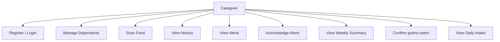
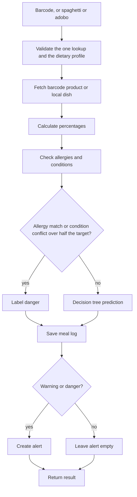
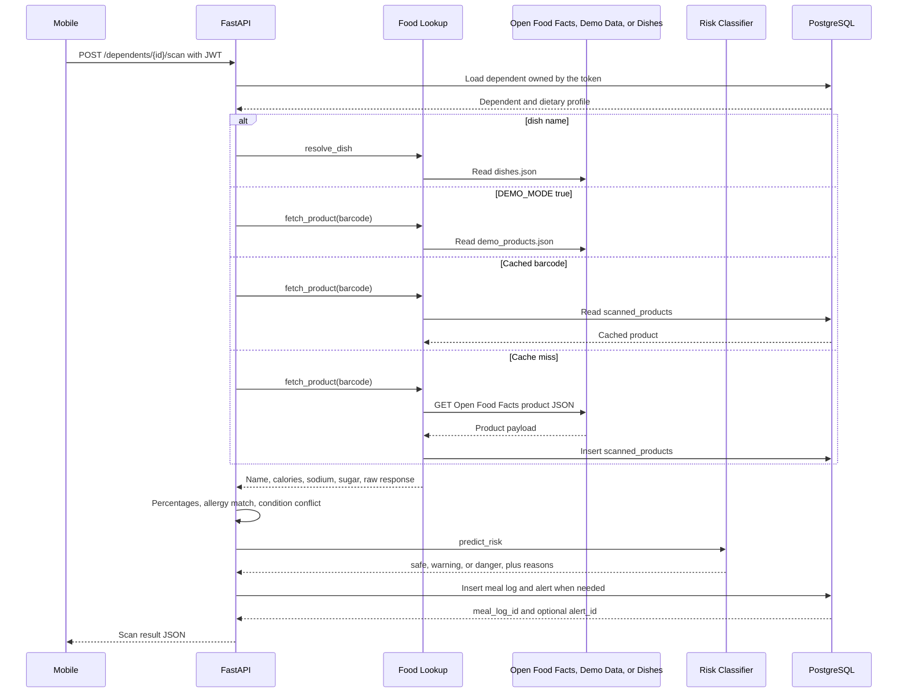
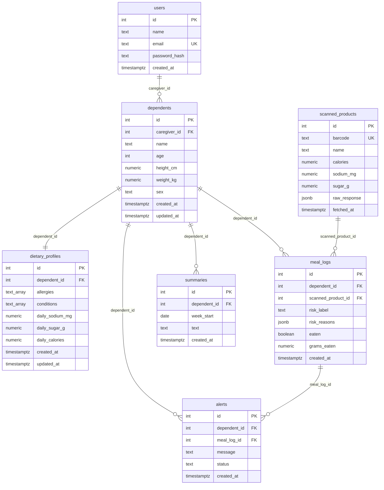
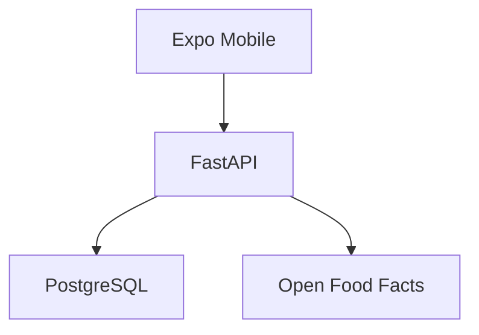

# Diagrams

These diagrams follow the current routes, models, and scan functions. The decision tree text and measured accuracy are in [ARCHITECTURE.md](ARCHITECTURE.md) and [MODEL_EVALUATION.md](MODEL_EVALUATION.md).

## 1. Use case

The caregiver is the only actor. Register and login are public. Every later case sends the JWT, and the API ignores any caregiver id sent by the phone.

Register is `POST /auth/register`. Login is `POST /auth/login`. Manage dependents is list, create, update, and delete under `/dependents`. Scan food is the camera, a manual barcode, or the dish names `spaghetti` and `adobo`. History, alerts, acknowledge, the weekly summary, and daily intake are the other tabs. `PATCH /alerts/{id}` acknowledges an alert. `PATCH /meals/{id}` records grams eaten.

## 2. Activity

`POST /dependents/{id}/scan` runs the steps below. An allergy match, or a condition conflict above half the matching target, assigns `danger` and does not let the tree override that label. The conflict can be hypertension and sodium, diabetic and sugar, diabetic and carbohydrate, high cholesterol and saturated fat, or kidney disease at age 12 or older and protein. Any other case calls the loaded decision tree. `warning` and `danger` insert an alert. `safe` does not. The meal starts uneaten.

Validation, lookup, nutrition, and prediction failures return the standard error body and do not insert a meal log.

## 3. Sequence

Ownership is checked before lookup. A dish name reads `dishes.json` and skips Open Food Facts. For a barcode, demo mode stops at the demo file. Live mode uses the `scanned_products` cache before Open Food Facts.

## 4. Entity relationship

Taken from `backend/app/models.py`. A dependent has one dietary profile (`dependent_id` is unique). Meal logs reference a scanned product and cannot outlive their dependent. An alert's `(meal_log_id, dependent_id)` must match that meal log. One summary row exists per dependent and `week_start`.

Check constraints limit age to 0–120, sex to `male` or `female`, risk labels to `safe`, `warning`, or `danger`, and alert status to `active` or `acknowledged`. Daily targets and body measurements must be positive. Cached nutrition must be zero or greater.

## 5. Deployment

The phone and FastAPI are separate processes. PostgreSQL is the `postgres:16` service in `docker-compose.yml`. The decision tree file is on the same machine as FastAPI and is loaded into that process. Open Food Facts is called only for a barcode when `DEMO_MODE` is not `true`. Typed dishes stay in `backend/dishes.json`.

